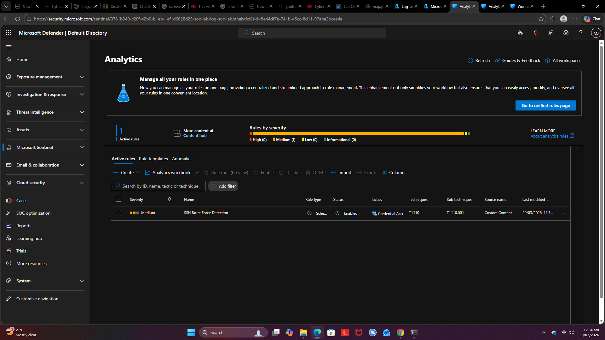
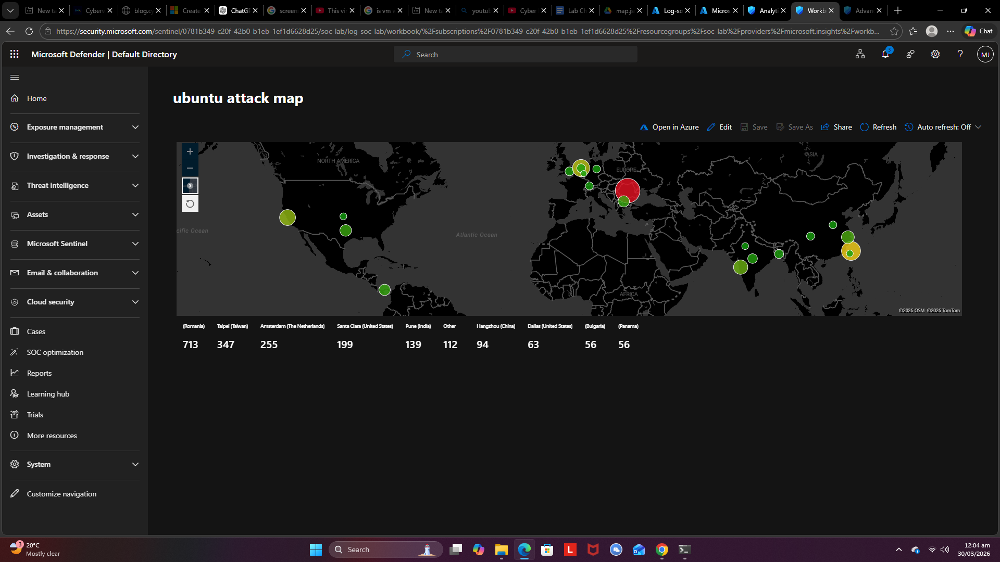
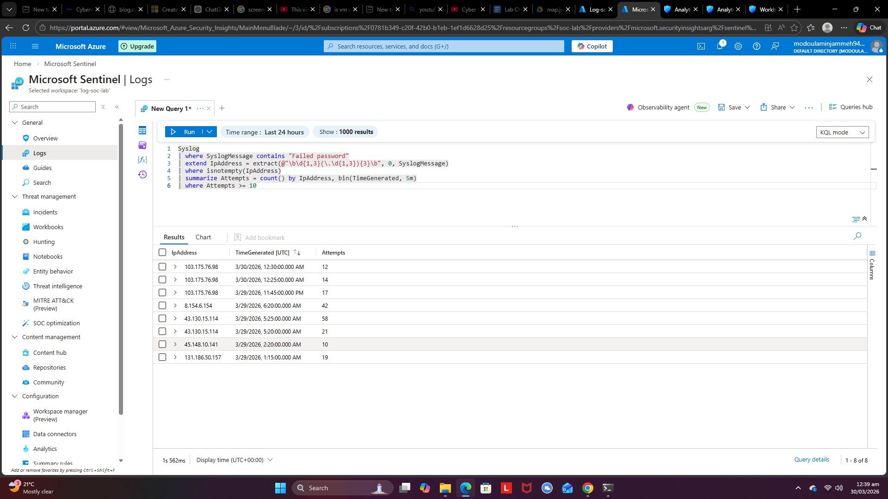
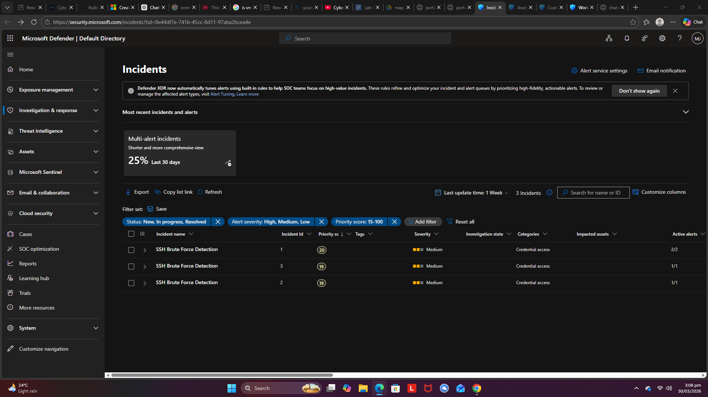
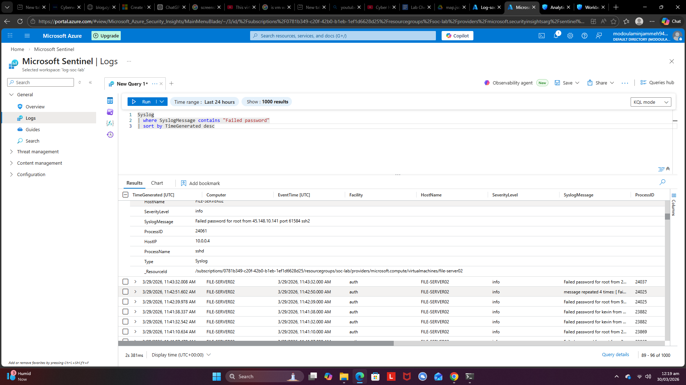
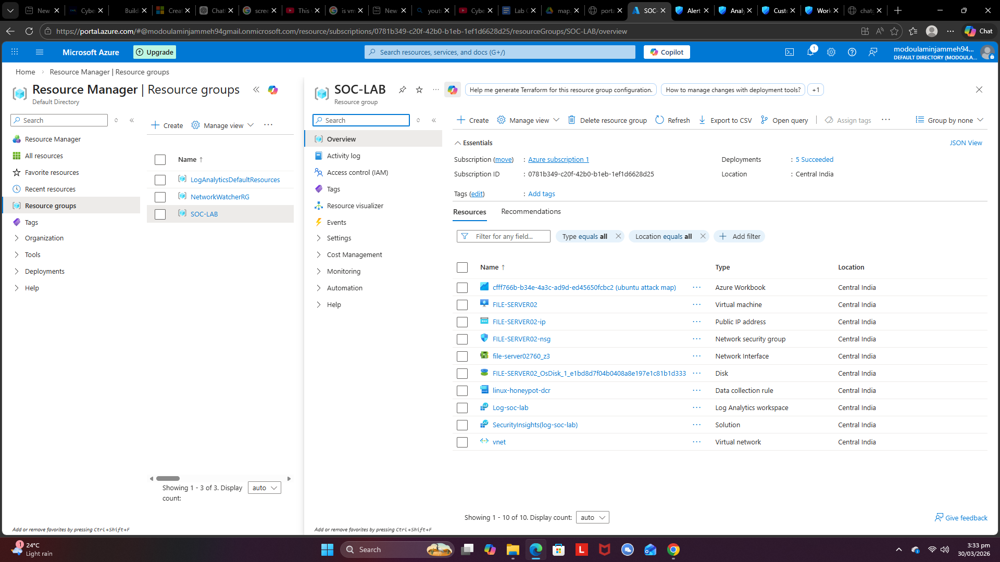

# 🛡️ Azure Honeypot SOC Lab

## 📌 Objective
The objective of this project was to build a cloud-based honeypot environment using Microsoft Azure to simulate real-world cyber attacks and monitor them from a defender’s perspective.

Instead of relying on theoretical knowledge, I focused on deploying a vulnerable system, exposing it to the internet, and capturing live attack data. This allowed me to understand how attackers behave and how their actions are reflected in logs within a SIEM.

---

## 🧠 Skills Learned

- Hands-on experience deploying and configuring a cloud-based honeypot  
- Practical use of SIEM (Microsoft Sentinel) for threat monitoring  
- Ability to analyze real attack data such as brute-force login attempts  
- Understanding of log ingestion and query using KQL (Kusto Query Language)  
- Improved incident detection and investigation workflow  
- Better understanding of attacker behavior in exposed environments  

---

## 🧰 Tools Used

- Microsoft Azure (Virtual Machines, Networking)  
- Microsoft Sentinel (SIEM)  
- Log Analytics Workspace  
- Ubuntu Server (Honeypot target)  
- SSH for remote access and monitoring  

---

## ⚙️ Lab Setup Overview

This lab simulates a real-world SOC scenario using a cloud environment:

- A publicly exposed Ubuntu virtual machine acts as the honeypot  
- Network security settings allow inbound traffic to attract attackers  
- Logs from the VM are sent to a Log Analytics Workspace  
- Microsoft Sentinel is used to monitor, query, and analyze the logs  
- Attackers on the internet generate real telemetry (e.g., SSH brute-force attempts)  

---
## 📸 Screenshots & Analysis

### 🔹 1. Alert Triggered

This screenshot shows alerts generated in Microsoft Sentinel based on suspicious activity detected in the environment.  
The alert indicates potential malicious behavior, such as repeated failed login attempts, which is a common indicator of a brute-force attack.

---

### 🔹 2. Attack Map Visualization

The attack map provides a geographical visualization of incoming connections to the honeypot.  
It highlights multiple source locations attempting to access the exposed VM, demonstrating how publicly exposed systems attract global attack traffic.

---

### 🔹 3. Detection Rules / Analytics

This image shows analytics rules configured in Microsoft Sentinel.  
These rules are responsible for detecting suspicious patterns (e.g., multiple failed SSH logins) and triggering alerts.  
It reflects how detection logic is implemented in a SIEM environment.

---

### 🔹 4. Incident View

This screenshot displays incidents generated from correlated alerts.  
Incidents group related alerts into a single case, making it easier to investigate and understand the full attack story.  
This is a key part of SOC workflows and incident management.

---

### 🔹 5. Log Analysis (KQL)

This image shows raw log data queried using Kusto Query Language (KQL).  
Here, I analyzed authentication logs to identify patterns such as repeated login failures, attacker IP addresses, and timestamps.  
This step is critical for deep investigation and validation of alerts.

---

### 🔹 6. Lab Architecture Overview

This diagram represents the overall architecture of the honeypot lab.  
It includes the Azure virtual machine, networking configuration, Log Analytics Workspace, and Microsoft Sentinel.  
This provides a high-level understanding of how data flows from the target system into the SIEM for monitoring and analysis.

---

## 🚀 Purpose

This project is part of my journey to becoming a SOC Analyst, focusing on blue team operations. By building and monitoring a live honeypot, I gain real-world experience in detecting threats, analyzing logs, and understanding how incidents are formed and investigated in a SIEM environment.
